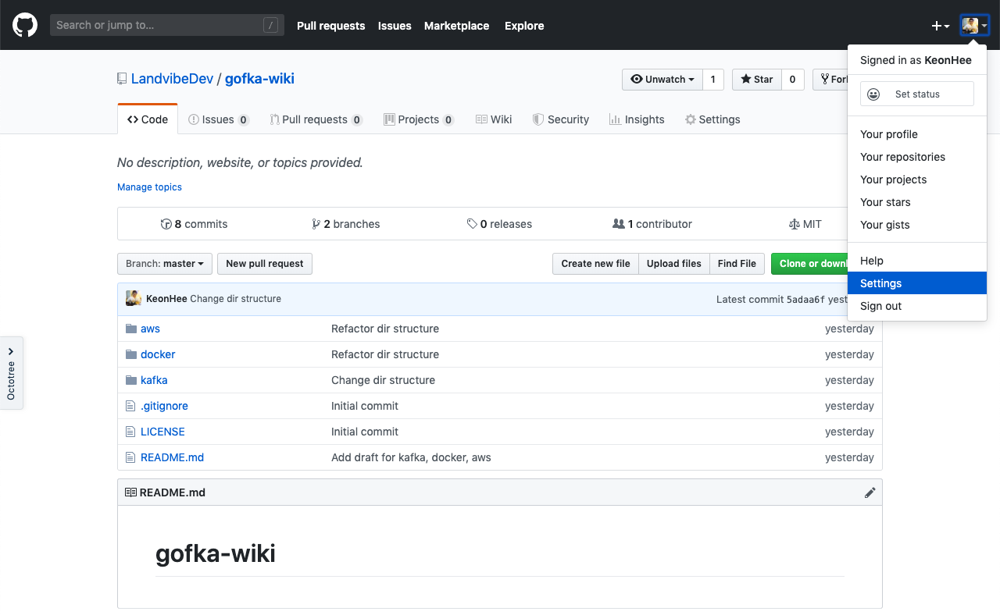
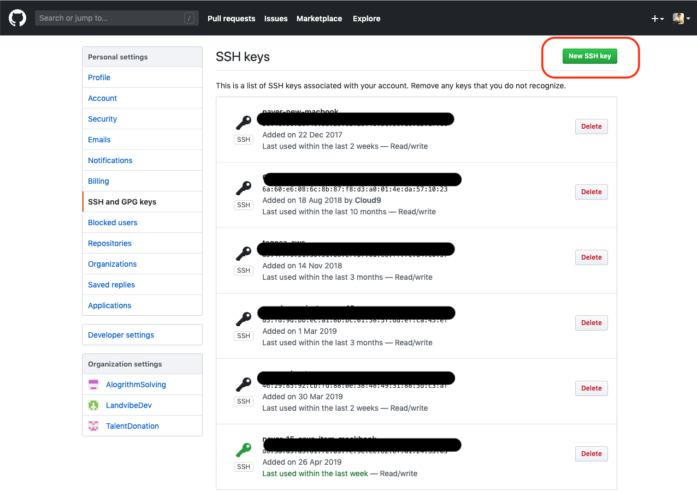
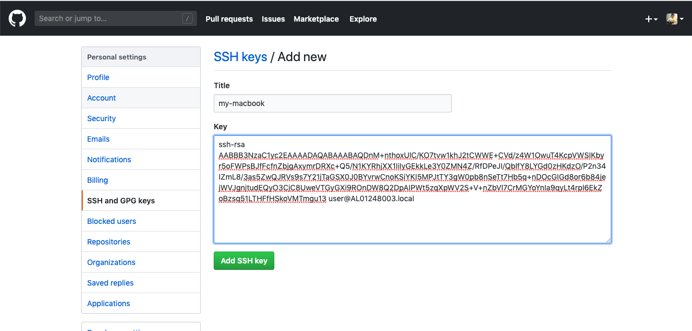

# Git

- 목차
  1. [Git의 구조](#1-git의-구조)
  2. [ssh key 등록](#2-ssh-key-등록)
  3. [브랜치따서 PR 올리기](#3-branch따서-pr-올리기)

## 1. Git의 구조


### 1.1 Working Directory(내컴퓨터)
- 작업을 하고 있는 공간
- `.git` 파일이 생성된 디렉토리의 하위 디렉토리들
- git이 디렉토리들의 파일 변화를 감지한다.


### 1.2 Stage Area(스테이지 영역)
- git에서 관리하고 싶은 파일들을 Stage 영역로 옮긴다
- Stage 영역에 포함되지 않은 파일들은 Repository로 커밋되지 않는다.
- `git add ${파일명}` 명령어로 특정 파일을 스테이지 영역으로 옮길 수 있다.

### 1.3 Local Repository(로컬 저장소)
- Stage 영역에서 관리하는 파일들의 변경사항이 저장되는 곳
- `git commit` 명령어로 변경사항을 로컬 저장소에 추가할 수 있다.
- 많이 쓰는 옵션
  - `git commit -a`: 변경되거나 삭제된 파일을 자동적으로 스테이지 영역에서 제외시킨다.(주의! 새로운 파일을 추가하지는 않음.)
  - `git commit -m ${메세지}`: 커밋 메세지를 같이 추가한다.


### 1.4 Remote Repository(원격 저장소)
- 내 컴퓨터가 아닌 git 서버(Github, Gitlab, Bitbucket)
- 근본적으로 로컬 저장소와 같다.
- 로컬에 저장하는 것은 유실의 위험이 있으니 Github과 같은 안전한 클라우드 서버에 소스를 보관하기 위한 목적을 가지고 있다.
- 원격 저장소에 소스를 저장하면 소스의 공유, 코드 리뷰 등의 협업이 가능해진다.
- `git push ${remote 저장소 이름} ${remote 저장소 branch}`
- 사용 예시
  - `git push origin master`
  - `git push upstream master`
  - `git push origin feature/add-readme`


## 2. ssh key 등록
Github 서버와 나의 로컬 저장소는 SSH키로 인증하기 때문에 내 컴퓨터의 SSH 공개키를 Github 서버에 등록해야한다.

참고한 사이트: https://git-scm.com/book/ko/v1/Git-%EC%84%9C%EB%B2%84-SSH-%EA%B3%B5%EA%B0%9C%ED%82%A4-%EB%A7%8C%EB%93%A4%EA%B8%B0

### 2.1 키 확인
`~/.ssh` 하위 폴더가 아래와 같다면 바로 [Github에 키를 등록](#23-github에-키-등록하기)하면 된다.
```bash
$ cd ~/.ssh
$ ls
authorized_keys  id_dsa       id_dsa.pub
```

- id_dsa: 비밀키, 절때 유출하면 안됨!
- id_dsa.pub: 공개키
- authorized_keys: 이곳에 공개키를 추가하면 다른 컴퓨터에서 나의 컴퓨터로 ssh 접근이 가능하다.


### 2.2 키 생성
`~/.ssh` 하위 폴더에 키가 생성되지 않았다면 `ssh-keygen` 명령어로 key를 생성한다.(엔터키 연타)
```bash
$ ssh-keygen
Generating public/private rsa key pair.
Enter file in which to save the key (/Users/schacon/.ssh/id_rsa):
Enter passphrase (empty for no passphrase):
Enter same passphrase again:
Your identification has been saved in /Users/schacon/.ssh/id_rsa.
Your public key has been saved in /Users/schacon/.ssh/id_rsa.pub.
The key fingerprint is:
43:c5:5b:5f:b1:f1:50:43:ad:20:a6:92:6a:1f:9a:3a schacon@agadorlaptop.local
```

### 2.3 Github에 키 등록하기

- Github -> 내 프로필 -> `Settings`


- `SSH and GPG keys` -> 우측 상단의 `New SSH key`



- `id_rsa.pub` 파일의 내용을 복사
```bash
$ cat id_rsa.pub
ssh-rsa AABBB3NzaC1yc2EAAAADAQABAAABAQDnM+nthoxUlC/KO7tvw1khJ2tCWWE+CVd/z4W1OwuT4KcpVWSIKbyr5oFWPsBJfFcfnZbjgAxymrDRXc+Q5/N1KYRhjXX1IiIyGEkkLe3Y0ZMN4Z/RfDPeJI/QblfY8LYGd0zHKdzO/P2n34IZmL8/3as5ZwQJRVs9s7Y21jTaGSX0J0BYvrwCnoKSiYKI5MPJtTY3gW0pb8nSeTt7Hb5q+nDOcGIGd8or6b84jejWVJgnjtudEQyO3CjC8UweVTGyGXi9ROnDW8Q2DpAIPWt5zqXpWV2S+V+nZbVl7CrMGYoYnIa9qyLt4rpl6EkZoBzsq51LTHFfHSkoVMTmgu13 user@AL01248003.local
```

- `ssh-rsa` 부터 `**@**.local`까지 복사 후 생성



## 3. branch따서 PR 올리기


### 3.1 브랜치 생성
```bash
git clone git@github.com:LandvibeDev/gofka-wiki.git
cd gofka-wiki
git checkout -b mybranch  # 새로운 브랜치 생성
```

### 3.2 변경 사항 원격 저장소로 푸쉬
```bash
git add .  # local stage에 추가
git commit -am "my commit message" # local repo에 커밋
git push origin mybranch # remote repo로 푸쉬, remote repo에 없다면 branch가 새로 생성됨
```
