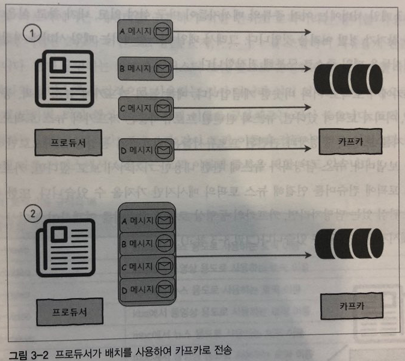
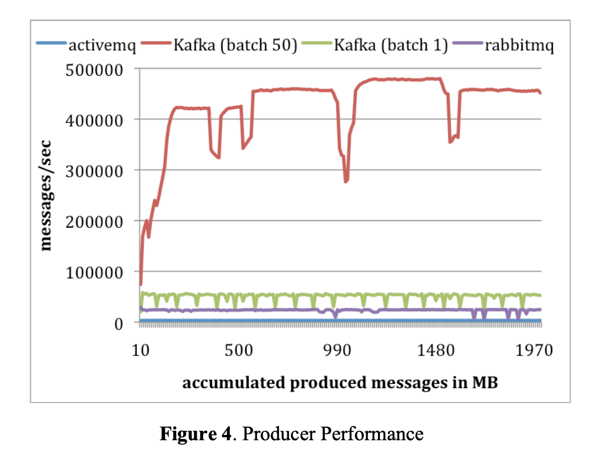
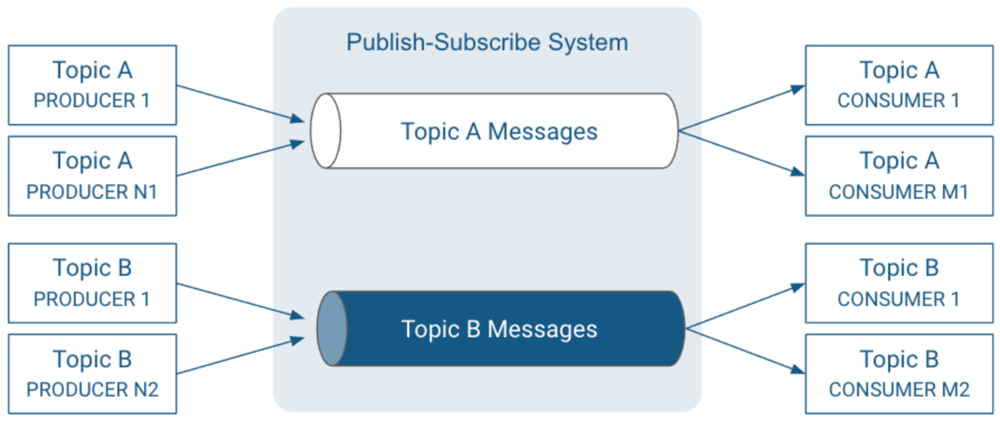
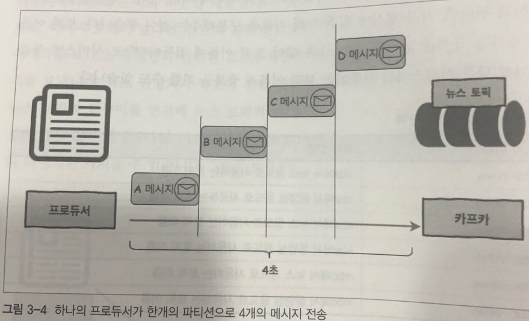
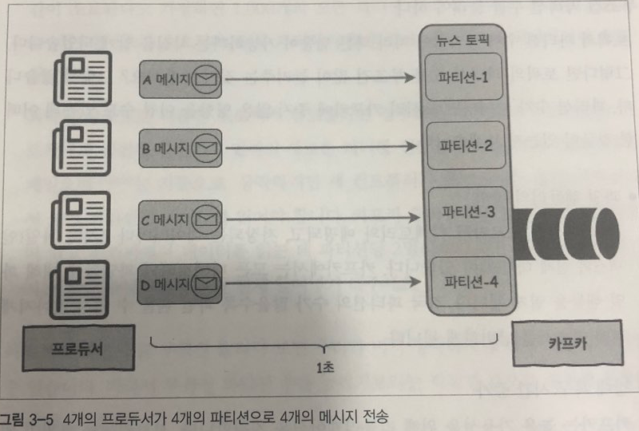

# 2. 카프카 디자인

## 2.1 카프카 디자인의 특징  
### 1. 분산 시스템
카프카는 분산 시스템으로 설계되어 있습니다.
  
분산 시스템의 장점  
- 단일 시스템보다 높은 성능
- 하나의 노드에 장애가 발생해도 다른 노드에서 대신 처리가 가능(고가용성)
- 시스템 확장이 용이

분산 시스템의 단점
- 구현이 어렵다.

### 2. 페이지 캐시
- KAFKA는 기존 메시징 시스템과는 달리 메시지를 메모리대신 파일 시스템에 쌓아두고 관리합니다.  
- 디스크에 기반한 영속적인 저장 방식을 사용하지만 페이지 캐시를 활용하여 높은 처리량을 제공하는 인메모리 방식에 가깝습니다.  
- 메모리에 별도의 캐시를 구현하지 않고 OS의 페이지 캐시에 위임하고 OS가 알아서 서버의 유휴 메모리를 페이지 캐시로 사용하여 앞으로 필요한 것으로 예상되는 메시지들을 미리 읽어들여(readahead)디스크 읽기 성능을 향상 시킵니다.  
- Kafka 프로세스가 직접 캐시를 관리하지 않고 OS에 위임하기 때문에 프로세스를 재시작 하더라도 OS의 페이지 캐시는 그대로 남아있기 때문에 프로세스 재시작 후 캐시를 워밍업할 필요가 없다는 장점이 있습니다.  
- 메시지를 메모리에 저장하지 않기 때문에 메시지가 JVM 객체로 변환되면서 크기가 커지는 것을 방지할 수 있고 JVM의 GC로 인한 성능 저하를 피할 수 있습니다.  

참고: https://brocess.tistory.com/79  

### 3. 배치 전송
네트워크 I/O를 줄이기 위해서 여러 메세지를 묶어서 하나의 커넥션으로 전송합니다.  
  

메세지를 묶어서 전송하기 때문에 네트워크 커넥션 횟수를 줄일 수 있고, 배치값을 늘릴 수록 producer의 성능이 월등하게 늘어납니다.  

  
50개를 한번에 전송할 때 성능이 10배 정도 증가한 모습  
  
참고: http://notes.stephenholiday.com/Kafka.pdf  

## 2.2 카프카 데이터 모델  

### 1. 토픽
메세지가 저장되는 곳, 메세지 종류의 논리적인 구분을 위해서 많이 사용합니다.  

공용 카프카를 여러 앱에서 사용할 때 예시  
| 토픽 이름 | 토픽 설명 |
| --- | --- |
| kh-log | 건희가 log 수집용으로 사용 |
| kh-alarm | 건희가 알람 큐 용도로 사용 |
| mk-log | 민교가 log 수집용으로 사용 |
| mk-alarm | 민교가 알람 큐 용도로 사용 |
| wg-log | 우곤이가 log 수집용으로 사용 |
| wg-alarm | 우곤이가 알람 큐 용도로 사용 |
| yj-log | 용준이가 log 수집용으로 사용 |
| yj-alarm | 용준이가 알람 큐 용도로 사용 |

### 2. 파티션
카프카에서는 하나의 토픽을 여러개의 파티션으로 나누어서 컨슈머로 전달합니다.  
토픽 내부적으로 생성되는 큐의 개수이며, 다수의 큐로 메세지를 병렬로 전달하기 때문에 성능적으로 얻는 이점이 큽니다.  

- 전송시간이 1초 걸리는 4개의 메시지들을 한개의 파티션으로 메세지를 하나씩 전송할 때, 하나의 파티션으로 전송하면 4초가 걸리지만, 4개의 파티션으로 전송했을 때 1초면 충분합니다.   

- **무조건 파티션의 수를 늘리는게 좋을까?**
  - 파일 핸들러의 낭비
    - 각 파티션은 브로커의 디렉토리와 매핑됩니다.
    - 저장되는 데이터마다 2개의 파일(인덱스와 실제 데이터)이 존재합니다.
    - 카프카는 모든 파일들에 대해 파일 핸들을 열기 떄문에 파티션의 수가 많을 수록 파일 핸들러의 수가 많아져서 리소스 낭비가 일어나게 됩니다.
  - 장애 복구 시간 증가 
    - 카프카는 높은 가용성(HA)를 위해서 replication을 지원합니다.
    - 각 파티션마다 replication이 동작하며, 토픽의 replication-factor만큼 파티션을 다른 브로커로 복제합니다.
    - 하나의 파티션이 리더이고 나머지 파티션은 팔로워가 됩니다.
    - 만약 1000개의 리더 파티션이 있는 브로커가 다운된다면? 리더선출이 파티션당 5ms가 걸린다해도 총 리더 선출에 소요되는 시간은 5초이며, 5초동안 시스템에 장애가 발생할 수 있는 위험이 있습니다.
    - **성능을 위한 무분별한 파티션 증가보다는, 허용할 수 있는 장애 복구 시간만큼 브로커의 파티션 수를 유지하는 것이 중요합니다.**

- **내 토픽의 적잘한 파티션 수는?**
  - 프로듀서와 컨슈머의 성능을 기준으로 파티션 개수를 설정해야 합니다.
  - 파티션의 개수를 줄이는 방법은 없으니, 작은 개수부터 시작해서 운영을 하다가 파티션에 병목이 발생했을 떄 증설하는 전략이 좋습니다.
  - 카프카에서는 브로커당 약 2,000개 정도의 최대 파티션을 권장합니다.
  

## 2.3 카프카의 고가용성과 리플리케이션  

## 2.4 모든 브로커가 다운된다면  

## 2.5 주키퍼 지노드의 역할  
