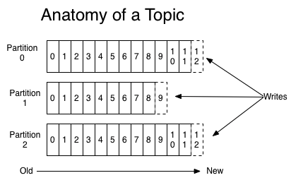
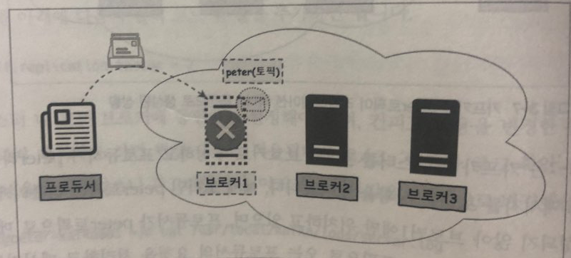
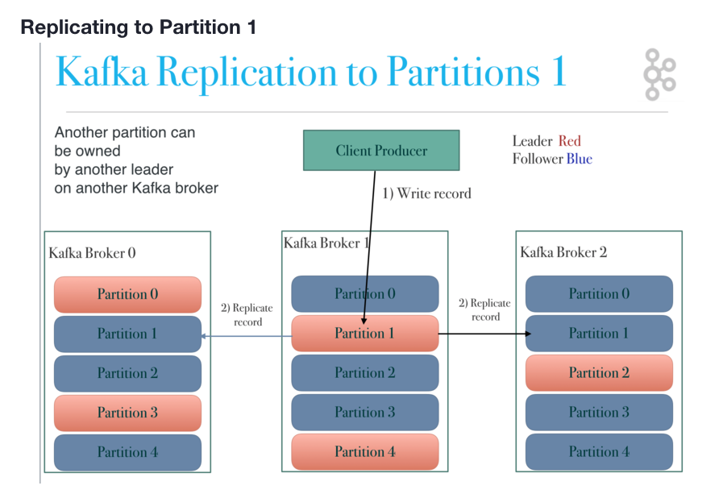
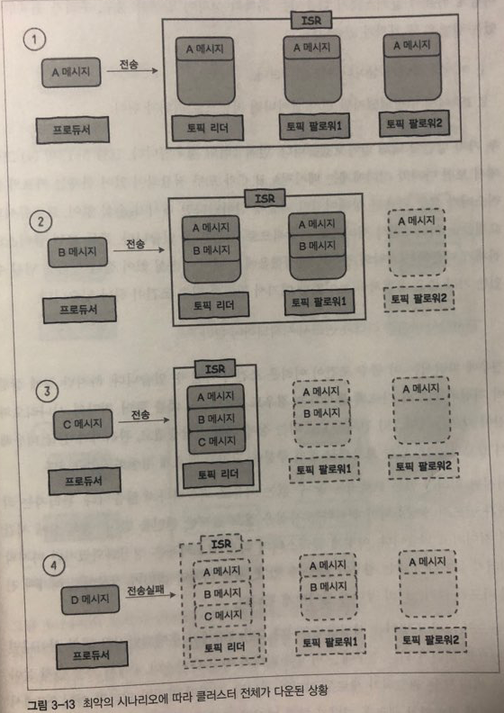
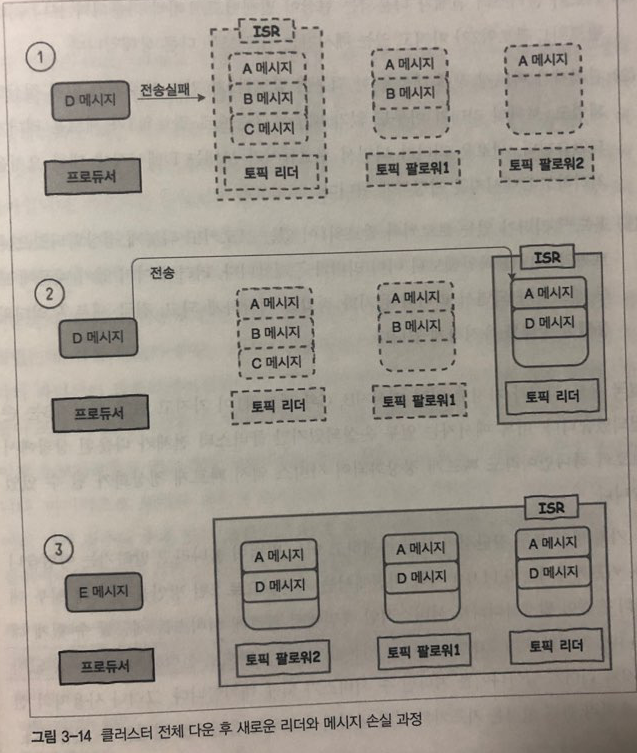

# 2. 카프카 디자인

## 2.1 카프카 디자인의 특징  
### 1. 분산 시스템
카프카는 분산 시스템으로 설계되어 있습니다.
  
분산 시스템의 장점  
- 단일 시스템보다 높은 성능
- 하나의 노드에 장애가 발생해도 다른 노드에서 대신 처리가 가능(고가용성)
- 시스템 확장이 용이

분산 시스템의 단점
- 구현이 어렵다.

### 2. 페이지 캐시
- Kafka는 기존 메시징 시스템과는 달리 메시지를 메모리 대신 **파일 시스템**에 쌓아두고 관리합니다.  
- 디스크에 기반한 영속적인 저장 방식을 사용하지만 **페이지 캐시**를 활용하여 높은 처리량을 제공하는 인메모리 방식에 가깝습니다.  
- 메모리에 별도의 캐시를 구현하지 않고 **OS의 페이지 캐시에 위임**하고 OS가 알아서 서버의 유휴 메모리를 페이지 캐시로 사용하여 앞으로 필요한 것으로 예상되는 메시지들을 미리 읽어들여(readahead)디스크 읽기 성능을 향상 시킵니다.  
- Kafka 프로세스가 직접 캐시를 관리하지 않고 OS에 위임하기 때문에 프로세스를 재시작 하더라도 OS의 페이지 캐시는 그대로 남아있기 때문에 프로세스 재시작 후 캐시를 워밍업할 필요가 없다는 장점이 있습니다.  
- 메시지를 메모리에 저장하지 않기 때문에 메시지가 JVM 객체로 변환되면서 크기가 커지는 것을 방지할 수 있고 JVM의 GC로 인한 성능 저하를 피할 수 있습니다.  

참고: https://brocess.tistory.com/79  

### 3. 배치 전송
네트워크 I/O를 줄이기 위해서 여러 메세지를 묶어서 하나의 커넥션으로 전송합니다.  
  

메세지를 묶어서 전송하기 때문에 네트워크 커넥션 횟수를 줄일 수 있고, 배치값을 늘릴 수록 producer의 성능이 월등하게 늘어납니다.  

  
50개를 한번에 전송할 때 성능이 10배 정도 증가한 모습  
  
참고: http://notes.stephenholiday.com/Kafka.pdf  


## 2.2 카프카 데이터 모델  

### 1. 토픽
메세지가 저장되는 곳, 메세지 종류의 논리적인 구분을 위해서 많이 사용합니다.  


공용 카프카를 여러 앱에서 사용할 때 예시  

| 토픽 이름 | 토픽 설명 |  
| --- | --- | 
| kh-log | 건희가 log 수집용으로 사용 | 
| kh-alarm | 건희가 알람 큐 용도로 사용 | 
| mk-log | 민교가 log 수집용으로 사용 | 
| mk-alarm | 민교가 알람 큐 용도로 사용 | 
| wg-log | 우곤이가 log 수집용으로 사용 | 
| wg-alarm | 우곤이가 알람 큐 용도로 사용 | 
| yj-log | 용준이가 log 수집용으로 사용 | 
| yj-alarm | 용준이가 알람 큐 용도로 사용 | 


### 2. 파티션
카프카에서는 하나의 토픽을 여러개의 파티션으로 나누어서 컨슈머로 전달합니다.  
토픽 내부적으로 생성되는 큐의 개수이며, 다수의 큐로 메세지를 병렬로 전달하기 때문에 성능적으로 얻는 이점이 큽니다.  

- 전송시간이 1초 걸리는 4개의 메시지들을 한개의 파티션으로 메세지를 하나씩 전송할 때, 하나의 파티션으로 전송하면 4초가 걸리지만, 4개의 파티션으로 전송했을 때 1초면 충분합니다.   


#### 1) 무조건 파티션의 수를 늘리는게 좋을까?
- 파일 핸들러의 낭비
  - 각 파티션은 브로커의 디렉토리와 매핑됩니다.
  - 저장되는 데이터마다 2개의 파일(인덱스와 실제 데이터)이 존재합니다.
  - 카프카는 모든 파일들에 대해 파일 핸들을 열기 떄문에 파티션의 수가 많을 수록 파일 핸들러의 수가 많아져서 리소스 낭비가 일어나게 됩니다.
- 장애 복구 시간 증가 
  - 카프카는 높은 가용성(HA)를 위해서 replication을 지원합니다.
  - 각 파티션마다 replication이 동작하며, 토픽의 replication-factor만큼 파티션을 다른 브로커로 복제합니다.
  - 하나의 파티션이 리더이고 나머지 파티션은 팔로워가 됩니다.
  - 만약 1000개의 리더 파티션이 있는 브로커가 다운된다면? 리더선출이 파티션당 5ms가 걸린다해도 총 리더 선출에 소요되는 시간은 5초이며, 5초동안 시스템에 장애가 발생할 수 있는 위험이 있습니다.
  - **성능을 위한 무분별한 파티션 증가보다는, 허용할 수 있는 장애 복구 시간만큼 브로커의 파티션 수를 유지하는 것이 중요합니다.**

#### 2) 내 토픽의 적잘한 파티션 수는?
- 프로듀서와 컨슈머의 성능을 기준으로 파티션 개수를 설정해야 합니다.
- 파티션의 개수를 줄이는 방법은 없으니, 작은 개수부터 시작해서 운영을 하다가 파티션에 병목이 발생했을 떄 증설하는 전략이 좋습니다.
- 카프카에서는 브로커당 약 2,000개 정도의 최대 파티션을 권장합니다.
  
#### 3) offset과 메세지 순서  



- 위 그림은 하나의 토픽을 총 3개의 파티션으로 나눈 그림입니다.
- 각각의 파티션에는 프로듀서가 전송한 메세지들이 저장되며 순차적으로 숫자가 부여됩니다.
- 이 숫자는 파티션마다 유니크한 값을 가지며 이를 offset이라고 합니다.
- 카프카에서는 offset으로 메세지의 순서를 보장하며, 그말인 즉슨 메세지들은 하나의 파티션 내에서의 순서만 보장됩니다.
- 절대로 offset 순서가 바뀐채로 메세지를 가져갈 수는 없습니다.

## 2.3 카프카의 고가용성과 리플리케이션  
카프카는 분산 애플리케이션으로 서버의 물리적 장애가 발생하는 경우에도 높은 가용성을 보장합니다.  
이를 위해 카프카는 Replication(복제) 기능을 제공합니다. 카프카의 Replication은 토픽 자체를 복제하는 것이 아니라 토픽을 이루는 각각의 **파티션**들을 복제합니다.

### 1. Replication을 하는 이유와 Replication Factor

- 위 그림 처럼 만약 Broker1이 다운된다면? 다운된 브로커에 있는 **모든 토픽들은 사용할 수가 없게 됩니다.**
- 만약 다운된 브로커가 지닌 토픽의 중요도가 매우 높다면, 이는 회사에 아주 큰 금전적인 손실을 끼칠 수 있습니다.
- 그래서 하나의 브로커가 다운되어도, 다른 브로커에서 Serving할 수 있도록 Kafka는 하나의 파티션을 여러 브로커에 복제를 합니다.
- Kafka에는 복제될 파티션의 개수를 조절하는 설정이 존재하는데, **replication-factor**가 그것 입니다.

### 2. Leader/Follower의 역할


- 파티션의 원본을 **Leader**, 복제된 파티션들을 **Follower**라고 합니다.  
- **모든 쓰기/읽기 작업은 Leader에서만 일어납니다.**  
- 평소 Follower는 단순히 Leader의 메세지를 복제만하다가 Leader가 불능에 빠졌을 때, Leader로써의 역할을 합니다.  

```bash
$ ./kafka-topics.sh --describe --zookeeper localhost:2181 --topic my-replicated-topic # 토픽 정보 확인
Topic:my-replicated-topic       PartitionCount:1        ReplicationFactor:3     Configs:
        Topic: my-replicated-topic      Partition: 0    Leader: 2       Replicas: 1,2,0  Isr: 2,0
```
- `ReplicationFactor:3`: 총 3개의 복제본(Leader + Follower)이 있다는 의미
- `Partition: 0`: 0번 파티션
- `Leader: 2`: Leader 노드는 broker2
- `Replicas: 1,2,0`: broker 0,1,2에 파티션0이 존재
- `Isr: 2,0`: broker 0,2만이 Leader가 될 수 있음

### 3. 복제로 인한 토픽 사이즈 크기 증가
Replication factor가 크다고 무조건 좋은 점만 있는 것은 아닙니다. 복제는 즉 리소스 사용량이 배가 된다는 뜻이며, 카프카 노드의 충분한 Storage 용량이 필요하다는 것을 뜻합니다.

| 토픽 사이즈 | Replication Factor | 필요한 Storage 크기 | 
| --- | --- | --- |
| 100GB | 1 | 100GB |
| 100GB | 2 | 200GB |
| 100GB | 3 | 300GB |


## 2.4 모든 브로커가 다운된다면  
(불운하게도) 모든 노드가 다운된다면, 이미 가용성에 타격을 입은 상태입니다. 이 때는 어떤 복구 전략을 사용해야 할 지 빠르게 선택 해야합니다.

### 1. 모든 노드가 다운되는 시나리오  



### 2. 모든 노드가 다운됬을 때 선택할 수 있는 전략
1. 마지막 리더가 살아나길 기다린다.
    - 메세지의 손실 없이 복구가 가능
    - 마지막 리더의 복구가 아주 늦거나 아예 복구되지 않을 수 도 있음
2. 가장 먼저 살아난 노드를 리더로 선정한다.
    - 메세지 손실이 일어날 가능성이 큼
    - 빠르게 전체 클러스터를 복구할 수 있음

### 3. 가장 먼저 살아난 노드가 리더가 될 경우 메세지가 손실되는 과정


