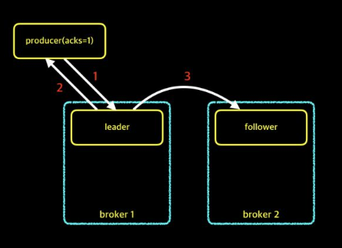
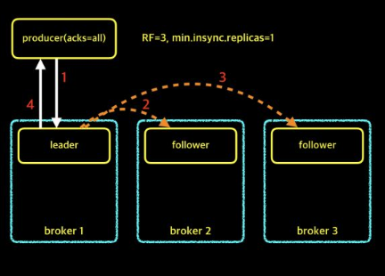

# 3. 카프카 프로듀서

## 3.1 프로듀서로 메세지 보내기
Go언어로 실습 진행 예정

## 3.2 프로듀서 주요 옵션
- `boostrap.servers`  
  - 카프카 클러스터는 모든 노드가 클라이언트의 요청을 받을 수 있습니다.
  - 클라이언트가 카프카에 접근하기 위한 접속 정보
  - 예시) `gofka-kafka01:9092,gofka-kafka02:9093,gofka-kafka03:9094`
  - 특정 호스트가 접속이 불가능할 때 다른 호스트로 연결을 위해서 모든 호스트의 접속정보를 적어 주는 것이 좋습니다.
- `acks`  
  - 프로듀서가 카프카 토픽의 리더에게 메세지를 보낸후 요청을 완료하기 전 ack의 수
  - 수가 작으면 성능이 좋지만 메세지 손실 가능성이 높아지고, 수가 크면 성능이 좋지 않지만 메세지 손실 위험이 낮아집니다.
  - `acks=0`
    - 프로듀서는 서버로부터 어떤 ack도 기다리지 않습니다.
    - 이 경우 서버가 데이터를 받았는지 보장하지 않고, 클라이언트는 전송 실패에 대한 결과를 모르기 때문에 재시도 설정도 적용되지 않습니다.
    - 메세지 손실 위험이 크지만, 서버의 응답을 기다리지 않기 때문에 높은 처리량을 얻을 수 있습니다.
  - `acks=1`
    - 리더의 응답만 기다립니다.
    - 약간의 데이터 손실이 발생할 가능성이 있습니다.
  - `acks=all or acks=-1`
    - ISR의 모든 리더와 팔로워의 응답을 기다립니다.
    - 데이터 무손실에 대해 가장 강력하게 보장합니다.
- `buffer.memory`  
  - 프로듀서가 카프카 서버로 데이터를 보내기 위해 잠시 대기 할 수 있는 전체 메모리 바이트입니다.
- `compression.type`  
  - 어떤 타입으로 압축해서 카프카 서버로 전달할지 정하는 옵션입니다.
  - `none`, `gzip`, `snappy`, `lz4` 등의 포맷을 정할 수 있습니다.
- `retries` 
  - 전송 오류로 인한 재시도 횟수를 정할 수 있습니다. 
- `batch.size`  
  - 프로듀서가 카프카로 메세지를 보낼 때, 한번에 묶어서 전송하는 메모리의 크기입니다.
  - batch size를 너무 크게하면 메세지 손실의 위험이 증가합니다.
- `linger.ms`
  - batch size에 도달하지 못했을 때 전송까지 대기하는 최대 시간입니다. 해당 시간이 지나면 batch size에 도달하지 못해도 즉시 메세지를 전송합니다.
  - 0이 기본값이며, 0보다 큰값을 설정하면 지연 시간은 조금 발생하지만 처리량은 좋아집니다.
- `max.request.size`  
  - 프로듀서가 보낼 수 있는 최대 메세지 바이트 사이즈입니다.
  - 기본값은 1MB 입니다.

## 3.3 메세지 전송 방법

| OPTION | 메세지 손실 | 속도 | 설명  
| --- | --- | --- | --- | 
| acks = 0 | 상 | 상 | 프로듀서는 자신이 보낸 메시지에 대해 카프카로부터 확인을 기다리지 않습니다. |
| acks = 1 | 중 | 중 | 프로듀서는 자신이 보낸 메시지에 대해 카프카의 leader가 메시지를 받았는지 기다립니다. follower들은 확인하지 않습니다. leader가 확인응답을 보내고, follower에게 복제가 되기 전에 leader가 fail되면, 해당 메시지는 손실될 수 있습니다. |
| acks = all(-1) | 하 | 하 | 	프로듀서는 자신이 보낸 메시지에 대해 카프카의 leader와 follower까지 받았는지 기다립니다. 최소 하나의 복제본까지 처리된 것을 확인하므로 메시지가 손실될 확률은 거의 없습니다.|

### 1. 메세지 손실 가능성이 높지만 빠른 전송이 필요한 경우: acks=0


- 프로듀서는 메세지를 보내고 leader로부터 보낸 메세지에 대해 잘 받았는지 확인을 기다리지 않습니다.
- 기다리는 시간 없이 메세지를 보내기만 하기 때문에 전송 속도가 매우 빠릅니다.
- 다만 전송을 받는 서버가 다운되면 메세지의 손실 가능성이 매우 높아집니다.

### 2. 메세지 손실 가능성이 적고 적당한 속도의 전송이 필요한 경우: acks=1


- 프로듀서는 메세지를 보내고 leader로부터 메세지를 잘 받았는지 확인을 기다립니다.
- `acks=0`보다는 전송속도가 느리지만, 메세지의 유실 가능성은 더 작습니다.
- 하지만 Follower에 복제되기 전에 응답을 받기 때문에 메세지 유실 가능성이 조금은 존재합니다.

#### 메세지가 유실되는 경우

1. 프로듀서가 acks=1로 메세지 전송
2. 파티션의 leader가 메세지를 받고 프로듀서에게 acks에 대한 응답
3. follwer에 메세지가 복제되기전에 leader가 다운
4. leader가 다운 됐기 때문에 follwer가 leader가 되고 메세지는 유실

위의 케이스는 정말 드물게 발생하기 때문에 실제 환경에서는 `acks=1` 옵션이 가장 많이 사용됩니다.

### 3. 전송 속도는 느리지만 메세지 손실이 없어야 하는 경우: acks=all(-1)


- 프로듀서는 메세지를 보내고 leader와 follower에 복제가 될 때까지 기다립니다.
- follwer에 복제된 것을 확인하기 때문에 메세지 유실 가능성은 극히 희박합니다.

그런데 만약 follower가 메세지 복제에 실패한다면, 어떤 상황이 발생할까요?  
프로듀서는 응답을 계속 기다릴까요? 아니면 전송을 중단할까요? 아니면 정상적으로 동작할까요?

#### min.insync.replicas
- 이 옵션은 프로듀서가 `acks=all`로 메세지를 보낼 때, write를 성공하기 위한 최소 복제본의 수를 의미합니다.
- 이 옵션은 프로듀서의 옵션이 아니라 브로커의 옵션이기 때문에 설정 변경후 브로커를 꼭 재배포 해줘야 설정이 적용됩니다.

#### Case 1. replication-factor=2, min.insync.replicas=1


- follwer에 복제가 실패하더라도 파티션의 leader는 프로듀서에게 확인 응답을 보냅니다.

#### Case 2. replication-factor=2, min.insync.replicas=2


- follwer에 복제가 실패한다면, 최소 복제수를 충족시키지 못하기 때문에 프로듀서에게 확인 응답을 보내지 못하고 write는 실패합니다.
- 브로커의 에러 로그
```
[2017-01-03 19:54:44,004] ERROR [Replica Manager on Broker 4]: Error processing append operation on partition peter-topic-rf2-0 (kafka.server.ReplicaManager) org.apache.kafka.common.errors.NotEnoughReplicasException: Number of insync replicas for partition [peter-topic-rf2,0] is [1], below required minimum [2] 
[2017-01-03 19:55:08,807] ERROR [Replica Manager on Broker 4]: Error processing append operation on partition peter-topic-rf2-0 (kafka.server.ReplicaManager) org.apache.kafka.common.errors.NotEnoughReplicasException: Number of insync replicas for partition [peter-topic-rf2,0] is [1], below required minimum [2]
```
#### Case 3. replication-factor=3, min.insync.replicas=1


- 모든 follwer들이 복제가 실패하더도 파티션의 leader는 프로듀서에게 확인 응답을 보낼 수 있습니다.
- 운영중에 브로커 노드 2대가 다운되더라도 프로듀서가 정상적으로 메세지를 보낼 수 있는 상황입니다.

#### Case 4. replication-factor=3, min.insync.replicas=2


- 하나의 follwer의 복제가 실패하더라도 최소 요구 수 2를 만족하기 때문에 프로듀서가 정상적으로 동작합니다.
- 하지만 2개의 follwer의 복제가 모두 실패한다면 최소 요구 수를 충족하지 못하기 때문에 프로듀서가 정상적으로 동작하지 않습니다.
- 브로커의 에러로그
```
[2017-01-03 19:57:44,403] ERROR [Replica Manager on Broker 3]: Error processing append operation on partition peter-topic-rf3-1 (kafka.server.ReplicaManager)
org.apache.kafka.common.errors.NotEnoughReplicasException: Number of insync replicas for partition [peter-topic-rf3,1] is [1], below required minimum [2]
[2017-01-03 19:57:54,589] ERROR [Replica Manager on Broker 3]: Error processing append operation on partition peter-topic-rf3-1 (kafka.server.ReplicaManager)
org.apache.kafka.common.errors.NotEnoughReplicasException: Number of insync replicas for partition [peter-topic-rf3,1] is [1], below required minimum [2]
```


참고: https://www.popit.kr/kafka-%EC%9A%B4%EC%98%81%EC%9E%90%EA%B0%80-%EB%A7%90%ED%95%98%EB%8A%94-producer-acks/