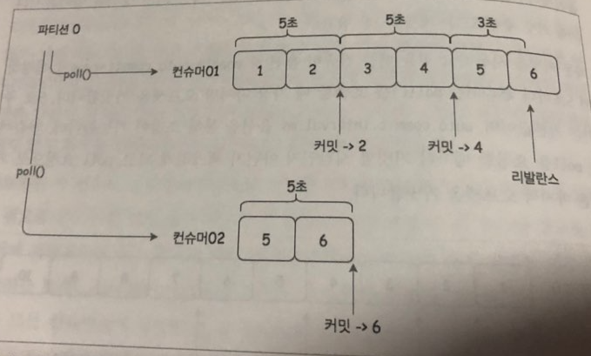

# 4. 카프카 컨슈머

## 4.1 컨슈머 주요 옵션  
- `boostrap.servers` 
  - 카프카 클러스터는 모든 노드가 클라이언트의 요청을 받을 수 있습니다.
  - 컨슈머가 카프카에 접근하기 위한 접속 정보
  - 예시) `gofka-kafka01:9092,gofka-kafka02:9093,gofka-kafka03:9094`
  - 특정 호스트가 접속이 불가능할 때 다른 호스트로 연결을 위해서 모든 호스트의 접속정보를 적어 주는 것이 좋습니다.
- `group.id`
  - 컨슈머가 속한 컨슈머 그룹을 식별하는 식별자입니다.
- `enable.auto.commit`
   - 백그라운드에서 `auto.commit.interval.ms` 시간마다 주기적으로 오프셋을 커밋합니다.
- `auto.commit.interval.ms`
   - 주기적으로 오프셋을 커밋하는 시간
- `auto.offset.rest`
   - 초기 오프셋이 없거나 현재 오프셋이 더 이상 존재하지 않는 경우 아래 옵션으로 리셋합니다.
   - `earliest`: 가장 초기의 오프셋 값으로 설정합니다.
   - `latest`: 가장 마지막의 오프셋 값으로 설정합니다.
   - `none`: 이전 오프셋값을 찾지 못하면 에러를 나타냅니다.
- `fetch-min.bytes`
  - 한번에 가져올 수 있는 최소 데이터 사이즈
  - 지정한 사이즈보다 작으면 요청에 응답하지 않고 데이터가 누적될 때 까지 기다립니다.
- `fetch.max.bytes`
   - 한번에 가져올 수 있는 최대 데이터 사이즈
- `fetch.max.wait.ms`
   - `fetch.max.bytes`에 의해 설정된 데이터보다 적은 경우 요청에 응답을 기다리는 최대 시간
- `request.timeout.ms`
   - 요청에 대해 응답을 기다리는 최대 시간
- `session.timeout.ms`
   - 컨슈머와 브로커 사이의 세션 타임 아웃 시간
   - 브로커가 컨슈머가 살아있는 것으로 판단하는 시간
   - 컨슈머가 세션 타임아웃 시간동안 heartbeat를 보내지 않으면, 해당 컨슈머에 장애가 발생한 것으로 판단하고 컨슈머 그룹을 리밸런스(rebalance)를 시도합니다.
   - `heartbeat.interval.ms` 시간 보다 높게 설정되어야 합니다.
- `heartbeat.interval.ms`
   - 컨슈머 그룹 코디네이터에게 얼마나 자주 `poll()` 메소드로 heartbeat를 보낼지 조정합니다.
   - `session.timeout.ms` 시간 보다 낮게 설정되어야 합니다. (일반적으로 1/3 정도로 설정합니다.)
- `max.poll.records`
   - 단일 호출 `poll()`에 대한 최대 레코드 수를 조정합니다.
   - 이 옵션을 통해 앱이 polling loop에서 데이터양을 조정할 수 있습니다.
- `max.poll.interval.ms`
   - 컨슈머가 단순히 heartbeat만 보내고 실제로는 `poll()` 메소드로 메세지를 가져가지 않는 경우가 있을 수도 있습니다.
   - 이러한 경우 컨슈머가 무한정으로 파티션을 점유할 수 없도록 주기적으로 `poll()`을 호출하지 않으면 장애라고 판단하여 컨슈머 그룹에서 제외합니다.

## 4.2 콘솔 컨슈머로 메세지 가져오기  
책보고 따라해보세요^^

## 4.3 파티션과 메세지 순서  

- 카프카 컨슈머에서의 메세지 순서는 동일한 파티션 내에서는 프로듀서가 생성한 순서와 동일하게 처리합니다.  
- 다른 파티션에 있는 메세지와는 순서를 보장하지 않습니다.  

### 순서를 보장하고 싶을 때는?
- 순서를 보장하고싶으면 **파티션 개수를 1**로 설정해야합니다.
- 메세지의 분산처리가 불가능하기 때문에 처리량의 한계가 존재(복제는 되기 때문에 HA는 보장)

## 4.4 컨슈머 그룹  
- 컨슈머는 카프카의 토픽을 읽어오는 역할을 합니다. 
- 하나의 토픽에 여러 컨슈머 그룹이 동시에 붙어서 메세지를 가져올 수 있습니다.  
- 다른 메세지 솔루션에서는 메세지를 가져가면 큐에서 삭제되서 다른 컨슈머가 가져갈 수 없는 것과 다른 방식입니다.  
- 이 방법은 하나의 데이터를 여러곳에서 사용하는 최근 트렌드와 부합합니다.

### 컨슈머의 확장

만약 프로듀서에서 보내는 메세지가 급증하여 카프카에 메세지가 쌓이는 문제가 발생할 수도 있습니다.  

컨슈머 그룹에 컨슈머를 추가해서 토픽에 들어오는 메세지를 병렬적으로 소비할 수 있습니다.  
- 컨슈머 그룹 안에서는 토픽의 파티션에 대한 소유권을 공유합니다
- 동일한 컨슈머 그룹아이디(`group.id`)를 설정하면 컨슈머 그룹에 join하게 됩니다.
- 컨슈머가 추가되면 파티션이 하나씩 할당됩니다. 이 과정을 **리밸런스** 라고 합니다.
- 리벨런스 과정에서는 컨슈머 그룹 전체에 메세지 소비가 중단됩니다. 리벨런스가 끝나게 되면 컨슈머들은 각자 담당하고 있는 파티션으로부터 메세지를 가져옵니다.

### 만약 컨슈머를 늘렸는데도 메세지가 쌓이면 어떻게 해야할까요?

이 상황에서는 컨슈머를 하나 추가해도 하나의 파티션에는 하나의 컨슈머만 연결할 수 있기 때문에 컨슈머하나가 놀게되고 메세지 처리 속도도 그대로 입니다.

파티션 하나에 여러개의 컨슈머가 붙으면 하나의 파티션 내에서의 메세지 순서보장이 힘들기 떄문입니다.  
파티션 수와 동일하게 컨슈머 수를 구성했다면, 파티션과 컨슈머를 동시에 늘려야 합니다.

### 컨슈머 장애

만약 하나의 컨슈머가 장애에 빠진다면?

리벨런스가 발생하여, 파티션과 컨슈머를 재배열합니다.

2개의 파티션에 매핑된 컨슈머가 존재, 특정 파티션의 처리 속도가 느려질 수도 있음

 

지속적으로 모니터링하여 파티션과 컨슈머의 수를 1:1로 맞춰주는 것이 좋음

### 컨슈머 그룹

- 서로 다른 컨슈머 그룹은 하나의 토픽에 대해 각 컨슈머 그룹만의 오프셋을 가집니다.
- 즉, 하나의 토픽에 대해서 여러 용도로 사용할 수 있습니다.
   - 예를들면 A팀에서 로그 메세지를 a 토픽으로 보내고 있는데, B팀에서 해당 로그가 필요하면, A팀에서는 a 토픽에 접근할 접속 정보만 전달하면 됩니다.

## 4.5 커밋과 오프셋 

컨슈머가 메세지를 가져오고 파티션에게 자신이 가져간 메세지의 위치 정보를 알려줍니다. 각 파티션에 대해 현재위치를 업데이트 하는 동작을 **커밋** 한다고 합니다.
 
오프셋 저장 위치
- v0.9 이전 주키퍼
- v1.0 이후 브로커

리밸런스 이후 파티션이 컨슈머와 다시 연결되면 가장 최근 커밋된 오프셋 이후부터 메세지를 가져옵니다.

### 자동 커밋

파티션에대한 오프셋 정보 관리, 파티션 변경에 대한 관리등은 매우 복잡한 작업입니다.  
컨슈머에서 오프셋관리를 하지 않는 것이 가장 최선의 방법.  

- `enable.auto.commit=true`로 설정
- 5초마다 `poll()`을 호출할 때 마지막 오프셋을 커밋합니다
- `auto.commit.interval.ms` 옵션을 통해 커밋 주기 변경 가능

### 자동 커밋의 단점

  

만약 5초 주기로 커밋되던 컨슈머에서 3초뒤에 리밸런스가 발생한다면?  
 - 리밸런스가 끝나고 연결된 컨슈머는 마지막 커밋인 4의 다음 메세지인 5번 메세지부터 가져온다(중복 읽기 발생)  

**결론: 자동 커밋을 사용하면 메세지의 중복이 발생할 가능성이 있습니다.**

### 수동 커밋

컨슈머가 메세지를 데이터베이스를 저장한다고 가정했을때, 일부 메세지들이 데이터 베이스에 저장되지 못하고 자동커 밋에 의해 커밋되면 메세지 유실이 발생합니다.

이런 경우를 방지하기 위해서 카프카는 컨슈머에서 데이터베이스에 메세지를 저장하고 커밋하는 방법을 지원합니다.

- `enable.auto.commit=false` 로 수정
- `poll` 함수로 메세지를 가져옴
- 메세지를 모주 가져온 후 `commitSync`를 통해 커밋  

하지만, 최악의 경우에는 데이터베이스 저장 도중에 실패하게 되면 데이터 베이스의 일부 메세지가 중복 저장될 수 있습니다.

**결론: 수동 커밋도 메세지의 중복이 발생할 가능성이 있습니다.**

### 특정 파티션 할당
토픽을 subscribe 하고 카프카의 컨슈머 분배 정책에 따라 파티션을 컨슈머에 매핑 시키는 방법도 있지만, 컨슈머에 특정 파티션을 직접 매핑 시킬수 있습니다.  

- 파티션 할당이 더 좋은 경우
  1. key-value 형태로 파티션에 저장, 특정 파티션에 대한 메세지만 가져와야 하는경우
  2. 컨슈머의 프로레스가 가용성이 높은 구성일 경우(YARN, Mesos 등), 카프카각 컨슈머의 실패를 감지하고 재조정할 필요없고 자동으로 컨슈머 프로세스가 시스템에서 재시작되는 경우

### 특정 오프셋부터 메세지 가져오기

카프카의 컨슈머 API를 사용하게 되면 메세지의 중복 처리등의 이유로 경우에 따라 오프셋 관리를 수동으로 해야하는 경우가 있습니다.  
`seek()` 메소드를 통해서 특정 오프셋부터 메세지를 가져올 수 있습니다.