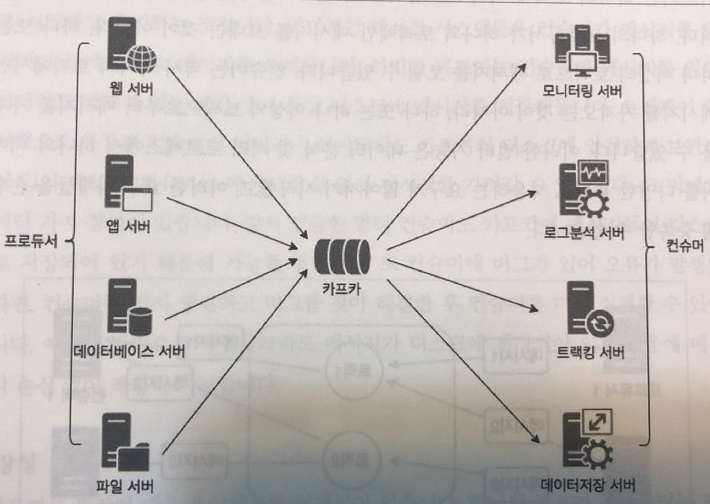

# Kafka

0. Kafka 스터디를 통해서 우리가 배울 것들
    - 기본 개념
      - Kafka의 특징
      - topic, partition
      - consumer, consumer-group, offset
      - HA, failover
    - Kafka 설치 및 클러스터 구성하기
      - ansible를 통해서 도커 컨테이너로 배포
    - Go 언어를 통해서 Producer/Consumer 만들어 보기

1. [Kafka란 무엇인가?](#1-kafka란-무엇인가)  
  1.1 카프카의 탄생 배경  
  1.2 카프카의 동작 방식과 원리  
  1.3 카프카의 특징  
  1.4 카프카의 확장과 발전

2. 카프카 디자인  
  2.1 카프카 디자인의 특징  
  2.2 카프카 데이터 모델  
  2.3 카프카의 고가용성과 리플리케이션  
  2.4 모든 브로커가 다운된다면  
  2.5 주키퍼 지노드의 역할  

3. 카프카 프로듀서  
  3.1 콘솔 프로듀서로 메세지 보내기  
  3.2 프로듀서 주요 옵션  
  3.3 메세지 전송 방법  

4. 카프카 컨슈머  
  4.1 컴슈머 주요 옵션  
  4.2 콘솔 컨슈머로 메세지 가져오기  
  4.3 파티션과 메세지 순서  
  4.4 컨슈머 그룹  
  4.5 커밋과 오프셋  

5. 카프카 운영가이드  
  TBD...  

# 1. Kafka란 무엇인가?

## 1.1 카프카의 탄생 배경
카프카는 미국의 대표적인 비지니스 인맥 소셜네트워크 서비스인 링크드인에서 처음 출발한 기술.  
링크드인 사이트가 급속도로 성장하면서 발생하는 내부 여러 이슈 들을 해결하기 위해 탄생.  

- 카프카가 개발되기전 링크드인의 데이터 처리 시스템
  

- 회사가 급성장하면서 요구 사항이 점점 더 많아지고 구조적 복잡성이 증가
- 발생한 문제점들 (책의 자세한 문제점 설명을 꼭 읽어볼 것)
  1. 실시간 트랜잭션 처리와 비동기 처리가 동시에 일어나지만 토합된 전송 영역이 없기 때문에 복잡도가 증가
  2. 데이터 파이프라인 관리의 어려움.
- 위와 같은 문제점을 해결하기 위해 만든 카프카의 4가지 목표
  1. 프로듀서와 컨슈머의 분리
  2. 메세징 시스템과 같이 영구 메세지 데이터를 여러 컨슈머에게 허용
  3. 높은 처리량을 위한 메세지 최적화
  4. 데이터가 증가함에 따라 Scale-out이 가능한 시스템

- 카프카를 이용한 링크드인의 데이터 처리 시스템

- 깔 - 끔

## 1.2 카프카의 동작 방식과 원리  

### 1. End-to-end Model  

- 승범/용준이 정희/준형을 직접 메세지를 전송
- 장점: 전송 속도와 전송 결과를 빠르게 알 수 있다
- 단점: 장애에 대한 처리를 개별적으로 해줘여하고 확장성이 좋지 않다

### 2. Pub/Sub Model  

- 프로듀서(승범/용준)이 메세지를 중간의 매세징 시스템에 전달
- 메세징 시스템이 컨슈머들(정희/준형)의 큐에 전달
- 컨슈머들은 자신들의 큐만 모니터링하고 있다가 큐에 메세지가 전달되면 값을 가져감
- 장점
  - 특정 컨슈머가 빠지거나 장애 상태더라도 메세징 시스템만 살아있으면 메세지가 유실되지 않음
  - 컨슈머만 다시 회복되면 메세지를 다시 가져갈 수 있음
  - 확장성이 좋음
- 단점
  - 메세지가 잘 전달 되었는지 확인하는 작업이 복잡해짐
  - 중간의 메세징 시스템 때문에 전달 속도가 빠르지 않음(상대적으로)

### 3. Kafka 아키텍처

- 프로듀서는 메세지를 카프카로 전송
- 프로듀서가 보낸 메세지는 카프카에 컨슈머 큐에 저장
- 컨슈머는 카프카 서버에 접속하여 메세지를 가져감

## 1.3 카프카의 특징  

### 프로듀서와 컨슈머의 분리

  

- 카프카를 사용하지 않은 구성
  - 특정 컨슈머의 장애나, 성능저하가 발생하면 그 영향이 프로듀서까지 전파된다.
    - 만약 모니터링 서버의 성능이 느려지면, 웹서버/앱서버/DB서버의 작업 처리가 느려지면서 장애가 전파되는 문제가 발생한다.
    - 만약 웹서버의 트래픽이 급증하면, 이를 처리하는 모니터링서버/로그분석서버의 트래픽도 급증한다.
  - Scale-out의 어려움
    - 특정 웹서버의 서버를 1대 늘릴 떄 의존성이 있는 컨슈머 서버들의 작업도 추가적으로 고려해야 한다.

- 카프카를 사용하는 Pub/Sub 구성
  - 프로듀서와 컨슈머가 완벽하게 분리되었음
  - 프로듀서와 컨슈머의 장애가 서로에게 전파되지 않음
  - 프로듀서나 컨슈머를 Scale-out 하더라도 다른 컴포넌트의 추가적인 작업이 필요 없음
  - 컨슈머가 메세지를 Polling하는 방식으로 구현 가능

### 멀티 프로듀서, 멀티 컨슈머

- 하나의 토픽에 여러 프로듀서 및 컨슈머들이 접근 가능
- 하나의 프로듀서가 여러 토팍에 메세지 전달 가능
- 하나의 컨슈머는 여러 토픽에서 메세지를 가져올 수 있음

**여러 컴포넌트들이 카프카를 중심으로 메세지를 생성/소비할 수 있다.**

### 디스크에 메세지 저장
카프카는 메세지를 일정 기간동안(설정 가능) 디스크에 저장하기 때문에 **메세지의 손실 위험이 매우 적다**
 - 컨슈머에 장애가 발생해도 카프카 디스크에 저장된 메세지를 다시 가져갈 수 있음
 - 카프카에 장애가 발생하더라도 디스크에 저장된 메세지를 다시 로드해서 컨슈머에게 전달할 수 있음

  
### 확장성
- 카프카 클러스터의 브로커는 3대부터 수십대까지의 확장이 가능
- 모든 확장 작업은 무중단으로 작업이 가능
- 처음에는 작은 규모로 카프카 클러스터를 구성했다가 트래픽이 증가함에 따라 큰 부담 없이 Scale-out이 가능

### 높은 성능
- 시장에서 많은 선택을 받은 가장 큰 이유중 하나
- 고성능을 유지하기 우해 내부적을 분산처리, 배치 처리 등 다양한 기법을 활용

### 카프카 용어 정리
- 브로커(Broker): 카프카가 설치되어 있는 서버 또는 노드
- 토픽(Topic): 메세지를 구분하기 위한 이름
- 파티션(Partition): 병렬처리를 위해 하나의 토픽을 여러개의 큐로 관리하는데 이 떄 나눠진 큐를 파티션이라고 부름
- 프로듀서(Producer): 메세지를 생산하여 브로커의 토픽이름으로 보내는 서버 또는 앱
- 컨슈머(Consumer): 브로커의 토픽 이름으로 저장된 메세지를 가져가는 서버 또는 앱

## 1.4 카프카의 확장과 발전
- 카프카를 통한 고성능의 Pub/Sub 모델이 가능해지면서, ESB를 쉽게 구현할 수 있게 됨
- ESB(Enterprise Service Bus)
  - 다양한 시스템과 연동하기 위한 멀티 프로토콜과 데이터 타입 지원
  - 느슨한 결합(loosely coupled)을 위한 메세지 큐 지원
  - 주기적으로 데이터를 가져오지 않고 이벤트 기반(Event-Driven)의 통신 지향

- 카카오 전사 리소스 모니터링 
  - http://tech.kakao.com/2016/08/25/kemi/

- Netflix Data Pipeline
  - https://medium.com/netflix-techblog/kafka-inside-keystone-pipeline-dd5aeabaf6bb

- OpenWhisk
  - https://openwhisk.apache.org/documentation.html

- 로그 플랫폼
  - 8월에 만들어 볼 Toy Project와 유사

