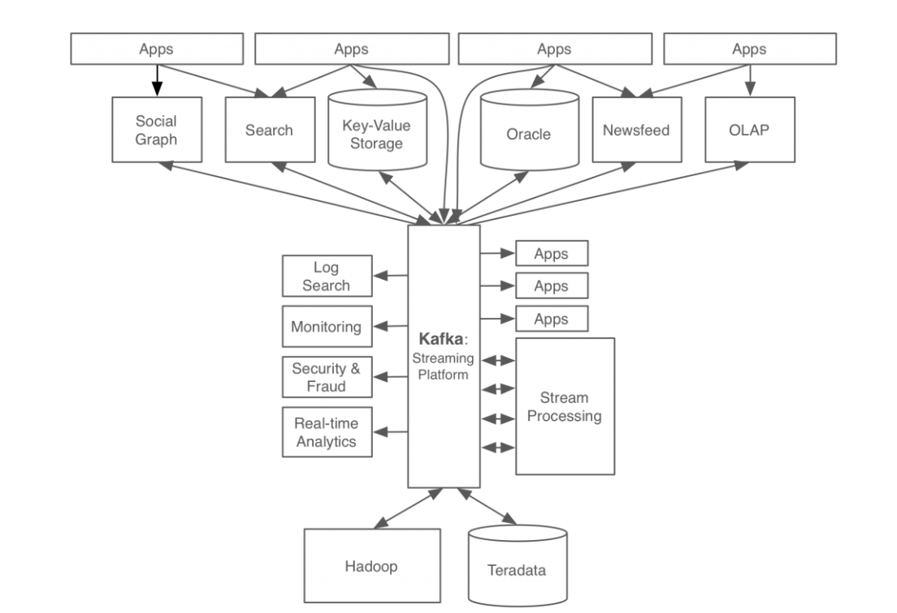
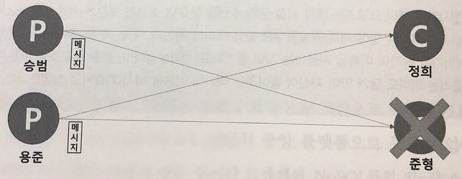
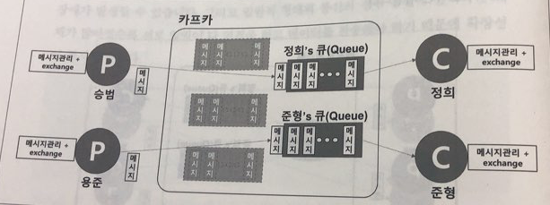

# Kafka

0. Kafka 스터디를 통해서 우리가 배울 것들
    - 기본 개념
      - Kafka의 특징
      - topic, partition
      - consumer, consumer-group, offset
      - HA, failover
    - Kafka 설치 및 클러스터 구성하기
      - ansible를 통해서 도커 컨테이너로 배포
    - Go 언어를 통해서 Producer/Consumer 만들어 보기

1. Kafka란 무엇인가?  
  1.1 카프카의 탄생 배경  
  1.2 카프카의 동작 방식과 원리  
  1.3 카프카의 특징  
  1.4 카프카의 확장과 발전

2. 카프카 디자인  
  2.1 카프카 디자인의 특징  
  2.2 카프카 데이터 모델  
  2.3 카프카의 고가용성과 리플리케이션  
  2.4 모든 브로커가 다운된다면  
  2.5 주키퍼 지노드의 역할  

3. 카프카 프로듀서  
  3.1 콘솔 프로듀서로 메세지 보내기  
  3.2 프로듀서 주요 옵션  
  3.3 메세지 전송 방법  

4. 카프카 컨슈머  
  4.1 컴슈머 주요 옵션  
  4.2 콘솔 컨슈머로 메세지 가져오기  
  4.3 파티션과 메세지 순서  
  4.4 컨슈머 그룹  
  4.5 커밋과 오프셋  

5. 카프카 운영가이드  
  TBD...  

# 1. Kafka란 무엇인가?

## 1.1 카프카의 탄생 배경
카프카는 미국의 대표적인 비지니스 인맥 소셜네트워크 서비스인 링크드인에서 처음 출발한 기술.  
링크드인 사이트가 급속도로 성장하면서 발생하는 내부 여러 이슈 들을 해결하기 위해 탄생.  

- 카프카가 개발되기전 링크드인의 데이터 처리 시스템
  

- 회사가 급성장하면서 요구 사항이 점점 더 많아지고 구조적 복잡성이 증가
- 발생한 문제점들 (책의 자세한 문제점 설명을 꼭 읽어볼 것)
  1. 실시간 트랜잭션 처리와 비동기 처리가 동시에 일어나지만 토합된 전송 영역이 없기 때문에 복잡도가 증가
  2. 데이터 파이프라인 관리의 어려움.
- 위와 같은 문제점을 해결하기 위해 만든 카프카의 4가지 목표
  1. 프로듀서와 컨슈머의 분리
  2. 메세징 시스템과 같이 영구 메세지 데이터를 여러 컨슈머에게 허용
  3. 높은 처리량을 위한 메세지 최적화
  4. 데이터가 증가함에 따라 Scale-out이 가능한 시스템

- 카프카를 이용한 링크드인의 데이터 처리 시스템

- 깔 - 끔

## 1.2 카프카의 동작 방식과 원리  

## 1.3 카프카의 특징  

## 1.4 카프카의 확장과 발전
