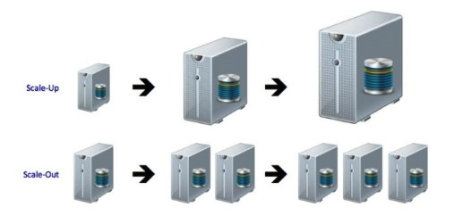

# Scalable Architecture - Distributed System

분산 시스템 구축을 위한 Scalable Architecture에 대해 알아봅니다.  

- Scale-Out vs Scale-Up
- Sharding
- Functional Programming

## Scale-Out vs Scale-Up

서버의 성능을 늘리는 방법에는 크게 두가지가 있다. Scale-Out과 Scale-Up이다. 보통의 분산 시스템에서는 Scale-Out이 더 바람직한 방향이지만, 항상 그런 것은 아니다.  

|         | Scale-Out           | Scale-Up  |
| ------- | ------------------- | --------- |
| 개요     | 하나의 장비에서 처리하던 일을 여러 장비로 나누는 것. 수평 확장. **지속적인 확장이 가능**                             | 더 빠른 CPU로 변경하거나, 더 많은 RAM을 추가하는 등의 하드웨어 장비의 성능을 높이는 것. 수직 확장 **성능 확장에 한계가 있음**  |
| 서버 비용 | 비교적 저렴한 서버를 사용하므로 일반적인 비용 부담이 적음. 서버가 너무 많아지면 네트워크 장비가 추가될 수도 있는데 이건 좀 비쌈 |   성능 증가에 따른 비용 증가 폭이 크며, 일반적으로 비용 부담이 큼. 기존에 쓰던 장비들을 쓰지 못하는 경우가 많음.              |
| 운영 비용 | 서버의 대수가 늘어날수록 관리가 힘들어지며, 운영 비용이 늘어남                                                   | 스케일 업에 따른 운영 비용의 증가는 거의 없음                                                                  |

## Sharding

## Functional Programming

### Go를 선택한 이유

## 참고
https://d2.naver.com/helloworld/206816